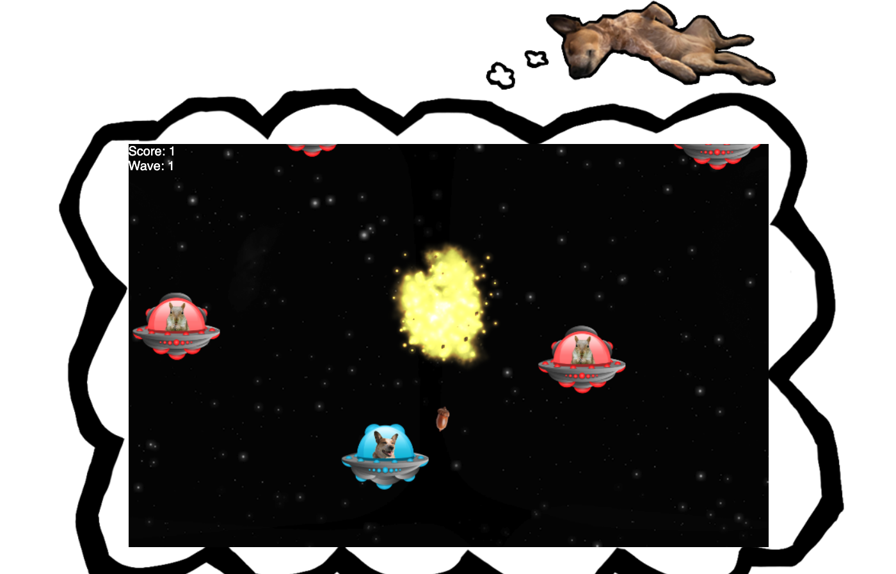

[back-end here](https://github.com/robotspacefish/invasion-backend)

# Invasion!

A game about my dog Penny, dreaming of battling squirrels in space. Invasion was built with JavaScript on the frontend and Rails on the backend.



## Installation
Clone project

cd into invasion-frontend

run
```
yarn install

# to run the dev server and build the project
yarn dev

# or to build the project
yarn build
```

Go [here](https://github.com/robotspacefish/invasion-backend) for the back-end and follow the readme instructions